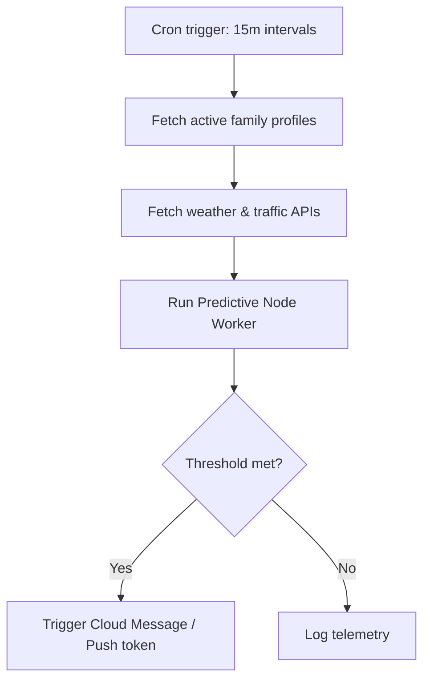

# Nestly — Scaling Architecture Specifications

This document outlines the engineering specifications and scalable code structures for Nestly's next-phase capabilities: predictive alerts, AI-driven email attachment parsing, voice command processing, Twilio SMS pipelines, and automated family chore balancing.

---

## 1. Predictive Reminders Pipeline
**Goal:** Automatically trigger household alerts based on dynamic context (e.g. weather, sports schedules, historical task completion rates).



### Serverless Cron Function (Node.js/Firebase Cloud Functions)
```javascript
// functions/src/predictiveReminders.js
const functions = require('firebase-functions');
const admin = require('firebase-admin');
const axios = require('axios');

exports.checkPredictiveRules = functions.pubsub.schedule('every 15 minutes').onRun(async (context) => {
  const db = admin.firestore();
  const usersSnapshot = await db.collection('profiles').where('onboarded', '==', true).get();

  for (const doc of usersSnapshot.docs) {
    const profile = doc.data();
    
    // Example: If kids have sports today, fetch the local weather forecast
    if (profile.sportsActivities) {
      const weather = await fetchWeather(profile.zipCode || '90210');
      
      if (weather.precipitationChance > 60 && !profile.notifiedRainToday) {
        await triggerGentleNotification(
          profile.userId,
          "Raining during sports",
          `Soccer looks damp today! Pack towels and extra dry socks in the car.`
        );
        await doc.ref.update({ notifiedRainToday: true });
      }
    }
  }
});
```

---

## 2. Inbound Email PDF Parsing AI
**Goal:** Parents forward school calendar PDFs or newsletter emails to `family-code@inbound.nestly.com`. Nestly parses schedules and imports them automatically.

### Pipeline Layout
```
[User Email + PDF] ──> [Sendgrid Inbound Parse] ──> [Webhook HTTP POST] ──> [Gemini Multimodal parser] ──> [Firestore Calendar doc]
```

### Inbound Webhook Script
```javascript
// functions/src/emailInboundParse.js
const functions = require('firebase-functions');
const { GoogleGenAI } = require('@google/genai');

exports.parseFamilyEmail = functions.https.onRequest(async (req, res) => {
  const { from, text, attachments } = req.body;
  const ai = new GoogleGenAI({ apiKey: process.env.GEMINI_API_KEY });

  // Locate the family code in the 'to' address: mom-dad-nest@inbound.nestly.com
  const familyCode = extractFamilyCode(req.body.to);
  const pdfAttachment = attachments.find(att => att.contentType === 'application/pdf');

  if (pdfAttachment) {
    // Invoke Gemini 1.5 Flash to read PDF
    const response = await ai.models.generateContent({
      model: 'gemini-1.5-flash',
      contents: [
        {
          inlineData: {
            mimeType: 'application/pdf',
            data: pdfAttachment.contentBytes // base64 encoded pdf
          }
        },
        {
          text: "Extract all key school events, field trips, holidays, and sports schedules. Return strictly a JSON array with fields: title, date (YYYY-MM-DD), time (HH:MM), and notes."
        }
      ]
    });

    const parsedEvents = JSON.parse(response.text);
    
    // Save to target Firestore family collection
    const db = admin.firestore();
    const batch = db.batch();
    parsedEvents.forEach(event => {
      const ref = db.collection('events').doc();
      batch.set(ref, {
        ...event,
        familyCode,
        member: 'Kids',
        color: '#E6A15C',
        syncedFrom: 'Email PDF'
      });
    });
    await batch.commit();
  }
  
  res.status(200).send('Email parsed successfully.');
});
```

---

## 3. Voice Input Transcription & Parsing
**Goal:** Parent presses a microphone button on the Nestly Dashboard to speak commands: *"Add clean school clothes to Mom's list for tomorrow morning."*

```typescript
// src/types/voice.ts
export interface VoiceCommandResponse {
  rawTranscription: string;
  classification: 'task' | 'event' | 'meal' | 'general_query';
  extractedPayload: {
    title: string;
    assignee?: 'Mom' | 'Dad' | 'Shared';
    dueDate?: string; // YYYY-MM-DD
    time?: string; // HH:MM
    category?: 'Home' | 'Kids' | 'Meals' | 'General';
  };
  calmingConfirmationMsg: string;
}
```

---

## 4. SMS Alerts Pipeline
**Goal:** Gently nudge parents via Twilio SMS when they haven't opened the app, avoiding the anxiety of high-stimulation mobile push notifications.

```javascript
// functions/src/smsAlerts.js
const twilio = require('twilio');
const client = twilio(process.env.TWILIO_SID, process.env.TWILIO_AUTH_TOKEN);

async function sendGentleSMS(phoneNumber, message) {
  try {
    await client.messages.create({
      body: `[Nestly] ${message}`,
      from: process.env.TWILIO_PHONE_NUMBER,
      to: phoneNumber
    });
  } catch (err) {
    console.error("SMS notification failed to dispatch:", err);
  }
}
```

---

## 5. Automated Scheduling Balancing
**Goal:** Distribute recurring tasks automatically so no single parent is overloaded on high-stress workdays.

```typescript
// src/services/balancingEngine.ts
export function balanceWeeklyChores(
  choresList: Array<{ id: string; durationMinutes: number }>,
  familyAvailability: {
    Mom: { stressScoreByWeekday: number[] }; // 0-10 score for Mon-Sun
    Dad: { stressScoreByWeekday: number[] };
  }
) {
  // Logic distributes high-duration tasks to co-parents on their lowest-stressed days
  // Returns assignments map
}
```
